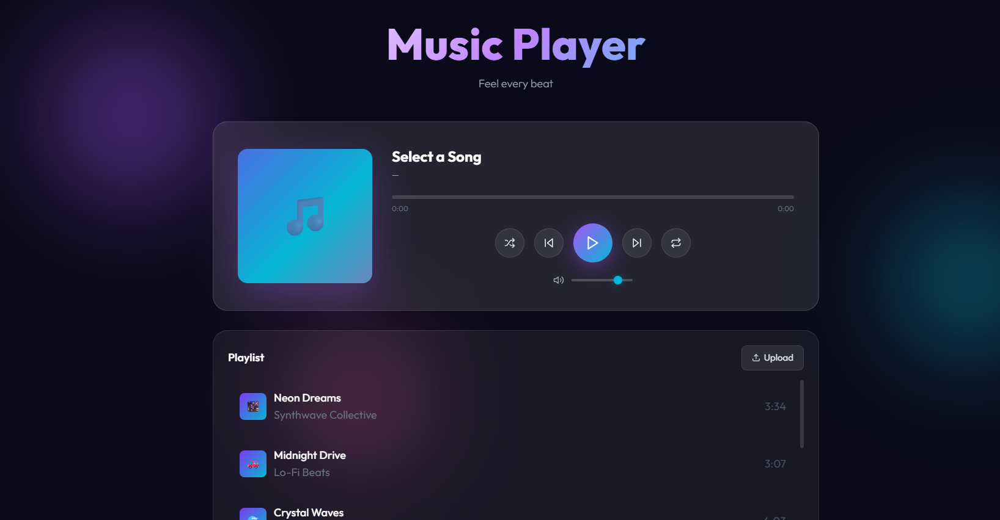

### 🎵 Glassmorphism Music Player

A modern, interactive Music Player Web App built using HTML, CSS, and JavaScript, featuring a beautiful glassmorphism UI, smooth animations, and dynamic playlist functionality.


---


### 🚀 Features
🎧 Play / Pause music<br>
⏭️ Next / Previous track controls<br>
🔀 Shuffle mode<br>
🔁 Repeat (Off / All / One)<br>
📊 Interactive progress bar (seek functionality)<br>
🔊 Volume control slider<br>
⌨️ Keyboard shortcuts support<br>
📁 Upload your own songs<br>
💾 Local storage support for uploaded tracks<br>
✨ Animated glassmorphism UI<br>
🎨 Dynamic album art animations<br>


---


### ⚠️ Important Note
Uploaded songs do NOT actually play real audio files.<br>

This project uses the Web Audio API (Oscillator) to simulate sound instead of playing real .mp3 or .wav files.<br>

👉 That’s why:<br>

Uploaded songs appear in playlist ✅<br>
But actual music does NOT play ❌<br>


---

### 🛠️ Tech Stack
HTML5<br>
CSS3 (Glassmorphism + Animations)<br>
JavaScript (Vanilla JS)<br>
Web Audio API<br>
Tailwind CSS (CDN)<br>
Lucide Icons<br>


---

### 📁 Project Structure
```
Music-Player/
│
├── index.html      # Main UI structure
├── style.css       # Styling (glassmorphism + animations)
├── app.js          # Logic & functionality
└── README.md       # Project documentation

```

---

## 🎮 Controls

| Action         | Key   |
|----------------|-------|
| Play / Pause   | Space |
| Next Song      | →     |
| Previous Song  | ←     |
| Volume Up      | ↑     |
| Volume Down    | ↓     |

---

## 📸 UI Highlights

- Glassmorphism cards<br>  
- Floating gradient orbs<br>  
- Animated album art<br>  
- Smooth transitions & hover effects<br>  

---

## 🔧 How to Run

1. Clone or download the repository  

```bash
git clone https://github.com/upasana-nayak307/Music-player.git
cd music-player

```
2. Open the project folder<br> 
3. Open `index.html` in your browser<br>  

👉 No installation required (runs locally in browser)<br> 

---

## 📸 Screenshots

### 🎧 Main Player UI


---

### 🚧 Future Improvements
✅ Real audio playback using <audio> tag<br>
🎵 Support for .mp3 / .wav files<br>
📂 Drag & drop upload<br>
🎚️ Equalizer visualization<br>
📱 Mobile responsiveness improvements<br>

---

### 💡 Learning Purpose
This project demonstrates:<br>

DOM manipulation<br>
Event handling<br>
UI/UX design (glassmorphism)<br>
Web Audio API basics<br>
State management in JavaScript<br>

---

### 💜 Credits
UI Inspiration: Glassmorphism design trends<br>
Icons: Lucide<br>
Fonts: Google Fonts (Outfit)<br>

---

### 👩🏻‍💻Author
**Upasana Nayak**<br>
Full-Stack Developer

---

### 📜 License
This project is for educational purposes and free to use.